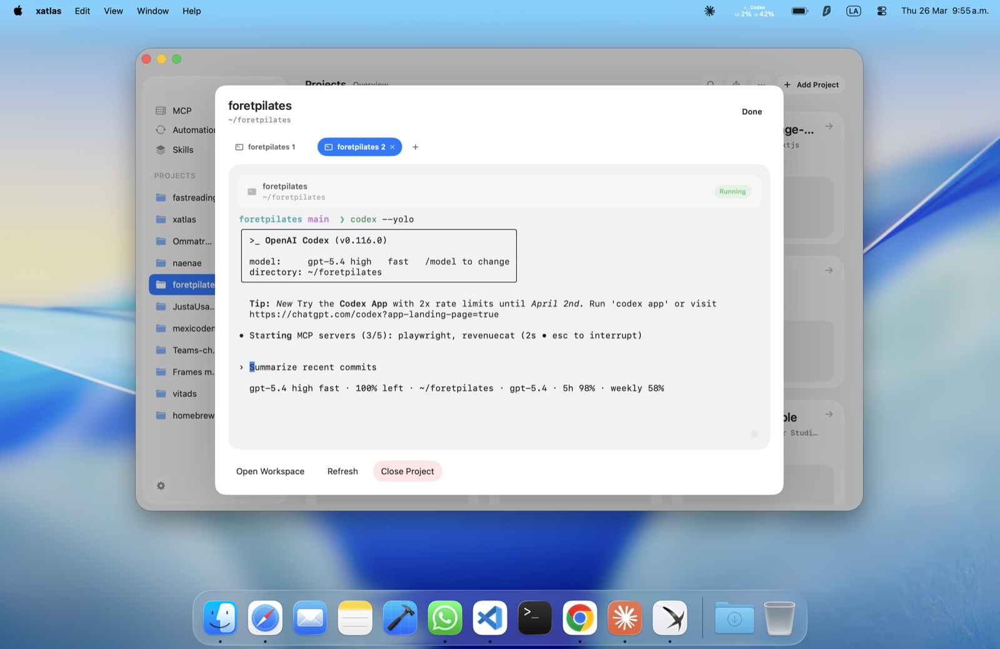
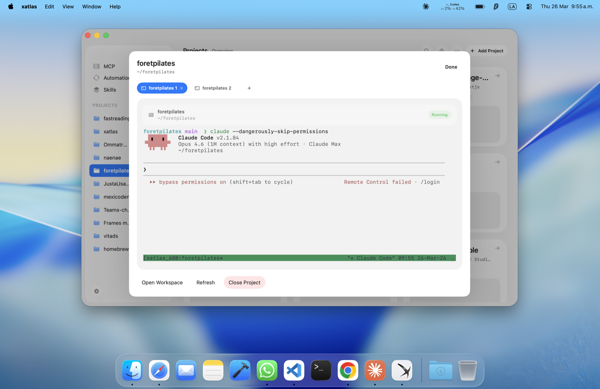
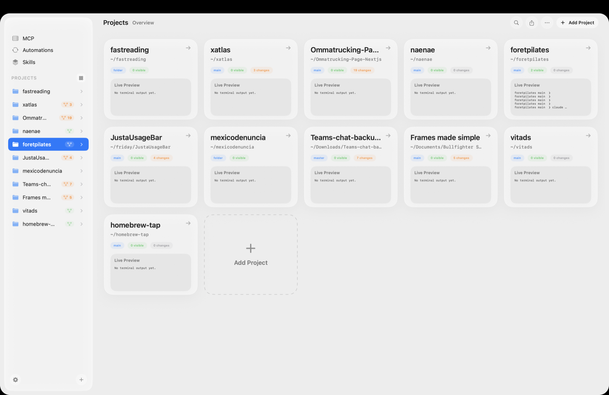

# xatlas

> A command line environment for macOS: projects, terminals, Git, MCPs, skills, and automations in one native workspace.

xatlas is the renamed continuation of the old `xerebro-operator-manager` project. It started around the VS Code extension, but the project now centers on the native xatlas app and its runtime.

Keep multiple repos open at once, jump between live terminals, inspect Git state, manage MCP servers and skills, and run AI-heavy workflows from one place without living inside a single editor window.

<p align="center">
  
</p>

## What xatlas includes

- `xatlas-app/`: the native macOS workspace for projects, terminals, source control, MCPs, skills, and automations
- `xatlas-bridge/`: the CLI/runtime package that users install as `xatlas`
- `relay/`: the optional pairing and reconnect service if you want to self-host that path

The VS Code extension in this repo is no longer the main product surface.

## Interface

| Overview | Project Dashboard |
| --- | --- |
|  |  |



## Install

Prerequisite:

```bash
brew install tmux
tmux -V
```

Primary CLI install:

```bash
npm install -g xatlas-bridge
xatlas up
```

Homebrew install:

```bash
brew tap betoxf/tap
brew install betoxf/tap/xatlas
xatlas up
```

The package keeps `xatlas-cle` and `xatlas-bridge` as compatibility aliases, but `xatlas` is the primary command name now.

## Commands

- `xatlas up`: start the normal runtime flow and print pairing information when needed
- `xatlas run`: run the foreground runtime directly
- `xatlas start`: install or start the macOS background service
- `xatlas stop`: stop the macOS background service
- `xatlas status`: show the macOS background service state
- `xatlas reset-pairing`: clear local pairing state and require a fresh QR bootstrap
- `xatlas resume`: reopen the last active thread
- `xatlas watch [threadId]`: tail the persisted rollout for a thread

## Source checkout

```bash
brew install tmux
./xatlas-app/scripts/install-app.sh
npm install -g ./xatlas-bridge
open -na /Applications/xatlas.app
xatlas up
```

Useful environment variables:

- `XATLAS_RELAY`: override the relay URL used by the runtime
- `XATLAS_PUSH_SERVICE_URL`: point completion pushes at a custom service
- `XATLAS_REFRESH_ENABLED`: enable desktop refresh hooks for the macOS app
- `XATLAS_MCP_PORT`: force the xatlas macOS app MCP port when needed
